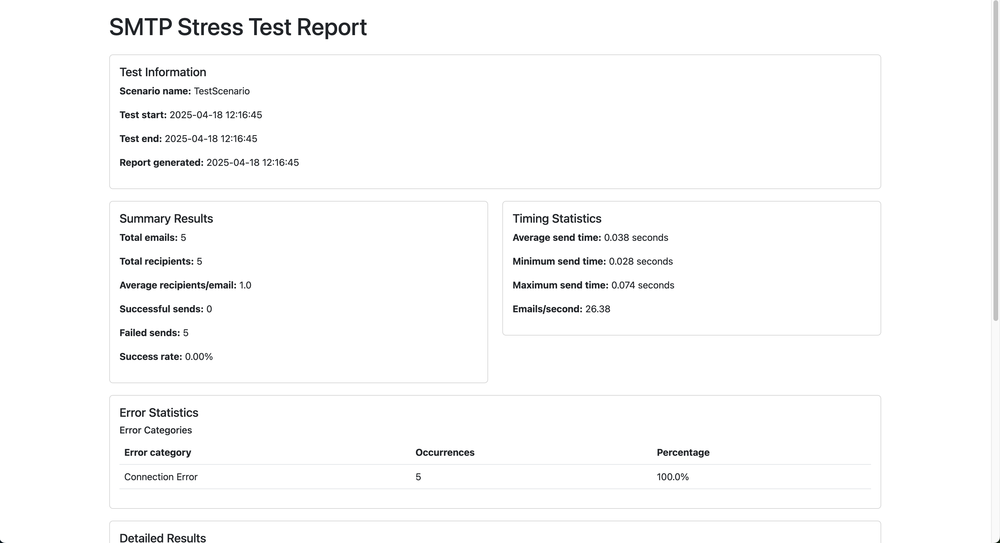

# SMTP Stress Test Tool





[](https://ko-fi.com/X8X01DODMO)

This application is a tool designed for load testing SMTP servers, allowing us to simulate sending large volumes of emails and measure server performance.

## Features

- **Test scenario management**: create, edit, upload, download, and delete
- **Running SMTP tests**: simultaneous (parallel) email sending on multiple threads
- **Test monitoring**: real-time status updates
- **Report generation**: detailed HTML and JSON reports
- **Log file management**: view, download, and delete
- **Global test control**: stop all running tests simultaneously
- **Customizable timeout settings**: set appropriate wait times for servers

## Installation and Startup

The application works with Python 3.13+ with the following dependencies:

- FastAPI
- aiosmtplib
- aiofiles
- Jinja2
- Uvicorn

### Installation

```bash
# Create virtual environment
python -m venv venv

# Activate virtual environment (Linux/MacOS)
source venv/bin/activate

# Activate virtual environment (Windows)
.\venv\Scripts\activate

# Install dependencies
pip install -r requirements.txt
```

### Starting the Application

```bash
# Start the application
uvicorn smtp_stress_test.main:app --reload
```

The application is available by default at `http://localhost:8000`.

## User Guide

### Scenario Management

#### Creating a New Scenario

1. Click on the "Create New Scenario" button
2. Fill out the form with the following parameters:
   - **Name**: Unique name for the scenario
   - **Description**: Brief description of the test purpose
   - **SMTP Settings**:
     - Server: SMTP server address (hostname or IP)
     - Port: SMTP port (typically 25, 465, or 587)
     - Use TLS: Check if the server uses TLS
     - Username and Password: If required
   - **Email Template**:
     - From email address
     - To email addresses (one per line or comma-separated)
     - CC and BCC addresses (optional)
     - Subject
     - Email body
     - Attachments (optional)
   - **Test Parameters**:
     - Number of threads: parallel email sending threads
     - Emails per thread: each thread will send this many emails
     - Delay between emails (seconds): wait time between each email send

3. Click the "Save" button

#### Uploading a Scenario

If you already have a previously created scenario in JSON format:

1. Click the "Upload Scenario" button
2. Select the JSON file
3. Click the "Upload" button

#### Editing a Scenario

1. On the scenario card, click the "Edit" button
2. Modify the parameters
3. Click the "Save" button

#### Downloading a Scenario

1. On the scenario card, click the "Download" button to download the scenario in JSON format

#### Deleting a Scenario

1. On the scenario card, click the "Delete" button
2. Confirm the deletion intent

### Running Tests

#### Starting a Test

1. On the scenario card, click the "Start Test" button
2. The test status updates automatically:
   - **Starting...**: The test is in preparation
   - **Running...**: The test is actively running
   - **Completed**: The test has finished successfully
   - **Stopped**: The test was manually stopped
   - **Error occurred**: An error occurred during the test

#### Stopping a Test

1. To stop a running test, click the "Stop" button on the scenario card

#### Stopping All Tests

1. If multiple tests are running simultaneously, click the "Stop All Tests" button at the top of the page

### Managing Reports

Reports are automatically generated after tests complete successfully.

#### Viewing Reports

1. In the "Test Reports" section, you can see all generated reports
2. On the report card, click the "HTML Report" button to view it in browser-friendly format
3. Click the "JSON Download" button to download the raw report data

#### Deleting Reports

1. To delete a report, click the "Delete" button on the report card
2. To delete all reports, click the "Delete All Reports" button

### Managing Log Files

Log files are created during each test run and contain detailed information about the test process.

#### Viewing Log Files

1. In the "Log Files" section, you can see all generated log files
2. On the log file card, click the "View" button to display the content in the browser
3. Click the "Download" button to download the complete log file

#### Deleting Log Files

1. To delete a log file, click the "Delete" button on the log file card
2. To delete all log files, click the "Delete All Log Files" button

### Managing Timeout Settings

The application allows customization of various timeout settings to optimize tests and adapt to different network environments.

#### Opening Timeout Settings

1. Click the "Timeout Settings" button in the button bar at the top of the page
2. In a pop-up modal window, you can adjust various timeout parameters

#### Adjustable Parameters

- **SMTP Connection Timeout (seconds)**: How long the system should wait for connecting to the SMTP server. Lower value = faster error detection, but higher chance of false positive errors on slow networks. Recommended value: 0.5-2 seconds.

- **SMTP Send Timeout (seconds)**: How long the system should wait for email sending. This applies to login, message sending, and connection termination. Recommended value: 1-3 seconds.

- **Status Refresh Interval (milliseconds)**: How often the test status indicator should refresh. Lower value = more frequent updates, but higher load. Recommended value: 300-1000 milliseconds.

#### Saving and Applying Settings

1. After setting the desired values, click the "Save" button
2. The settings are automatically saved in both the browser and on the server
3. The new settings will take effect on subsequent operations (e.g., starting a test)
4. The settings persist even after closing and reopening the browser

## Troubleshooting

### Known Issues and Their Solutions

1. **Connection Error to SMTP Server**
   - Check the server address and port number
   - Verify that the TLS setting is correct
   - Check the username and password

2. **Timeout Errors**
   - You can increase timeout values in the Timeout Settings module if you are using a slower network
   - The default 1-second timeout value provides an appropriate balance between speed and reliability in most cases
   - If you frequently experience timeout errors, try increasing the connection and send timeout values to 2-3 seconds

3. **Report Not Generated**
   - Check the log files for error details (use the Log View feature)
   - Make sure the test was not manually interrupted

4. **Recipient Errors**
   - Check that email addresses are in the correct format
   - If you loaded email addresses from a CSV or TXT file, verify they are in the proper format (one per line or comma-separated)

## Additional Help

If you need additional assistance, check the log files, which contain detailed information about errors and program operation.

## Docker Usage

The application can be run in a Docker container, which simplifies installation and management of environmental dependencies.

### Building and Starting the Docker Image

```bash
# Build the image
docker build -t smtp-stress-test .

# Start the container
docker run -p 8000:8000 -v $(pwd)/logs:/app/logs -v $(pwd)/reports:/app/reports -v $(pwd)/scenarios:/app/scenarios smtp-stress-test
```

### Using Docker Compose (recommended)

```bash
# Build and start the container
docker-compose up -d

# View logs
docker-compose logs -f

# Stop the container
docker-compose down
```

### Persistent Data Storage

The following folders are set as volumes in the Docker configuration to ensure data persists after container restart:
- `./logs`: Storage for log files
- `./reports`: Storage for generated reports
- `./scenarios`: Storage for scenarios

## Support This Project

If you find this tool helpful, consider supporting its development:

[](https://ko-fi.com/X8X01DODMO)

Or scan this QR code:


